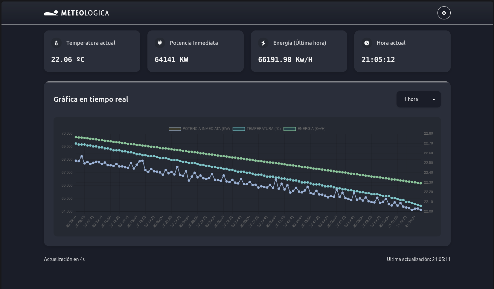
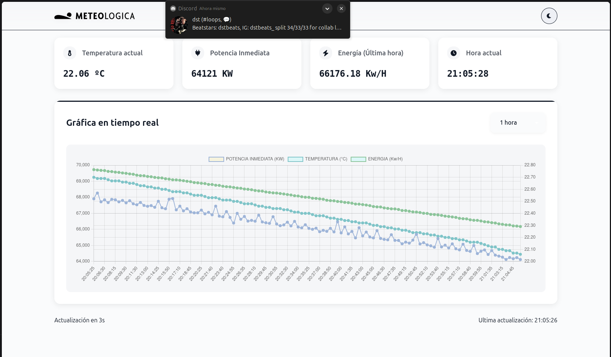

# Meteologica - Visualizador de Datos Meteorológicos en Tiempo Real





## Resumen del Proyecto

El objetivo es visualizar datos meteorológicos (temperatura, potencia y energía) en tiempo real, cargándolos desde un archivo YAML y actualizando la información cada 5 segundos para simular un flujo de datos en vivo, asegurando el manejo correcto de la cantidad de datos en el gráfico.

La aplicación muestra:

* Gráfico interactivo con tres series de datos (Potencia (KW), Temperatura (ºC), Energía (kWh))
* Tarjetas informativas con valores actuales en tiempo real
* Selector de rango temporal (1, 5, 10, 30, 60 minutos)
* Tema claro/oscuro con persistencia en `localStorage`
* Sistema de notificaciones (toasts) para feedback al usuario
* Diseño responsive adaptado a móvil, tablet y desktop

## Tecnologías Utilizadas

### Core

* **Svelte 5** - Framework reactivo con las nuevas Runes API (`$state`, `$derived`, `$effect`) (Requerido en la oferta)
* **TypeScript** - Tipado estático para mayor robustez
* **Vite** - Build tool y dev server ultrarrápido

### Librerías

* **Chart.js 4** - Renderizado de gráficos interactivos
* **downsample** - Algoritmo LTTB para optimización de datos
* **js-yaml** - Parser de archivos YAML
* **Font Awesome** - Iconos (hoja de estilos cargada desde CDN)

### Herramientas de desarrollo

* **svelte-check** - Validación de tipos en componentes Svelte
* **@tsconfig/svelte** - Configuración TypeScript optimizada para Svelte

### Justificación de Librerías

* **Chart.js**: Elegida por:
  - Excelente rendimiento con grandes conjuntos de datos
  - Soporte nativo para TypeScript
  - Comunidad activa y documentación extensa
  - Configuración declarativa que integra bien con Svelte

* **downsample**: Seleccionada por:
  - Implementación eficiente del algoritmo LTTB
  - Crucial para optimizar rendimiento con series temporales largas
  - No tiene depndencias extras solo implementa los algoritmos de downsampling

* **js-yaml**: Escogida por:
  - Parser YAML robusto y maduro
  - Tipos TypeScript incluidos

## Arquitectura del Proyecto

```
meteologica-prueba/
├── public/
│   └── data/
│       └── data.yml              # Datos meteorológicos fuente
├── src/
│   ├── components/
│   │   ├── Chart.svelte          # Componente del gráfico con Chart.js
│   │   ├── Header.svelte         # Cabecera con logo y toggle de tema
│   │   └── Toast.svelte          # Sistema de notificaciones
│   ├── services/
│   │   ├── data.service.svelte.ts # Lógica de gestión de datos
│   │   ├── theme.svelte.ts       # Servicio de gestión de tema
│   │   └── toast.service.svelte.ts # Lógica de gestión de toasts
│   ├── types/
│   │   ├── chart.d.ts           # Tipos para el gráfico y datos
│   │   └── toast.d.ts           # Tipos para el sistema de notificaciones
│   ├── utils/
│   │   └── time.utils.ts        # Utilidades para manejo de tiempo
│   ├── App.svelte               # Componente principal
│   ├── app.css                  # Estilos globales y variables CSS
│   ├── consts.ts               # Constantes globales
│   └── main.ts                 # Punto de entrada
├── package.json
├── svelte.config.js
├── tsconfig.json
├── tsconfig.app.json
├── tsconfig.node.json
└── vite.config.ts
```

## Componentes Principales

### App.svelte

* Componente raíz que orquesta toda la aplicación
* Carga y parsea el archivo YAML mediante `DataService`
* Calcula la energía acumulada (kWh) de la última hora
* Gestiona intervalos de actualización (reloj, datos, contador)
* Filtra datos según la hora actual del sistema
* Renderiza las tarjetas informativas y el componente Chart
* Maneja estado de carga

### Chart.svelte

* Encapsula la lógica de Chart.js
* Implementa downsampling con LTTB para optimizar rendimiento
* Selector de rango temporal (1-60 minutos)
* Responsive con `ResizeObserver`
* Tres ejes Y para diferentes magnitudes

### Header.svelte

* Logo de Meteologica
* Toggle de tema claro/oscuro con persistencia
* Integración con `ThemeService`

### Toast.svelte

* Sistema de notificaciones
* Soporte para múltiples estados (ok, error, info, warn)
* Animaciones

## Servicios

### DataService

Servicio singleton responsable del manejo de datos meteorológicos:

* **Carga de Datos**
  ```typescript
  static async loadAndProcessYMLData(): Promise<Measurements>
  ```
  - Fetch asíncrono de datos YAML
  - Parsing y validación de estructura
  - Manejo de errores con propagación al sistema de notificaciones

* **Normalización de Unidades**
  - Temperatura: Conversión Kelvin → Celsius (`value * 0.1 - 273.15`)
  - Potencia: Normalización de separadores decimales y conversión a kW
  - Energía: Cálculo acumulativo con ventana temporal

* **Optimización de Datos**
  ```typescript
  static downsample(data: DataForRender, target: number): DataForRender
  ```
  - Implementación de algoritmo LTTB (Largest Triangle Three Buckets)
  - Reducción adaptativa de puntos según ventana temporal
  - Preservación de tendencias y patrones significativos

### ThemeService

Servicio singleton para gestión del tema visual:

* **Gestión de Estado**
  ```typescript
  theme = $state<Theme>("dark")
  ```
  - Estado reactivo con Svelte 5 Runes
  - Tipado estricto de temas (`"light" | "dark"`)

* **Persistencia**
  ```typescript
  private initialize(): void
  ```
  - Lectura/escritura en localStorage
  - Fallback a preferencias del sistema (`prefers-color-scheme`)
  - Aplicación inmediata de cambios al DOM

* **API Pública**
  ```typescript
  toggleTheme(): void
  ```
  - Alternancia entre temas
  - Actualización atómica de estado y localStorage
  - Notificación de cambios a componentes suscritos

### ToastService

Servicio singleton para el sistema de notificaciones:

* **Gestión de Estado**
  ```typescript
  toasts = $state<ToastItem[]>([])
  ```
  - Cola FIFO de notificaciones
  - Límite configurable (`MAX_TOASTS`)
  - Tipos de estado: `ok | error | info | warn`

* **Control de Lifecycle**
  ```typescript
  show(message: string, options: ToastOptions): string
  remove(id: string): void
  clearAll(): void
  ```
  - Auto-dismiss configurable (`TOAST_TIMEOUT`)
  - Generación de IDs únicos
  - Limpieza automática de recursos

* **Integración con Componentes**
  - Sistema de colas para múltiples notificaciones
  - Animaciones de entrada/salida con Svelte transitions
  - Soporte para HTML en mensajes

## Diseño Técnico

### Estado y Reactividad (Svelte 5 Runes)

```ts
// Estado reactivo con Runes
let measurements = $state<DataForRender | null>(null);
let actualTemperature = $state(0);

// Computaciones derivadas
let windowed = $derived.by(() => {
  // Lógica de filtrado y downsampling
});

// Efectos secundarios
$effect(() => {
  if (windowed && chart) {
    updateChart(windowed);
  }
});
```

### Optimización de Rendimiento

* **Downsampling de Datos**: Algoritmo LTTB para reducir puntos
* **Gestión de Canvas**: ResizeObserver para redimensionado eficiente
* **Limpieza de Recursos**: Cancelación de intervalos y observadores
* **Lazy Loading**: Carga dinámica de datos según ventana temporal

### Manejo de Tiempo

```ts
// Tiempo actual en segundos desde inicio del día
function currentSecondsOfDay(): number {
  const now = new Date();
  return now.getHours() * 3600 + now.getMinutes() * 60 + now.getSeconds();
}

// Cálculo de energía por intervalo
const INTERVAL_HOURS = 5 / 3600;
const energyInInterval = powerValues[i].value * INTERVAL_HOURS;
```

## Ejecución y Desarrollo

### Requisitos previos

* Node.js ≥ 18.x
* npm ≥ 9.x

### Instalación

```bash
# Clonar el repositorio
git clone <url-del-repositorio>
cd meteologica-prueba

# Instalar dependencias
npm install
```

### Scripts disponibles

```bash
# Desarrollo con hot-reload
npm run dev

# Compilar para producción
npm run build

# Previsualizar build
npm run preview

# Verificar tipos TypeScript
npm run check
```

## Notas Técnicas

### Manejo de datos faltantes

* Temperatura: Valores NaN filtrados en cálculos y visualización
* `spanGaps: true` en Chart.js para continuidad visual
* Validación de datos en transformaciones

### Conversiones de unidades

* Temperatura: `(kelvin * 0.1) - 273.15` → °C
* Potencia: `watts / 1000` → kW
* Energía: `Σ(potencia * 5/3600)` → kWh (última hora)

## Lógica de Actualización de Datos

### Sincronización temporal

1. **Reloj en tiempo real** (actualiza cada 1s)

```ts
setInterval(() => {
  getHour(); // Actualiza actualTime
}, 1000);
```

2. **Contador regresivo** (actualiza cada 1s)

```ts
setInterval(() => {
  const elapsed = (Date.now() - lastRefresh) / 1000;
  dataInterval = 5 - Math.floor(elapsed % 5);
}, 1000);
```

3. **Refresh de datos** (cada 5s)

```ts
setInterval(() => {
  measurements = refreshData(data);
  lastRefresh = Date.now();
}, 5000);
```

### Filtrado de datos

```ts
function refreshData(data: Measurements | null): DataForRender | null {
  const nowSeconds = currentSecondsOfDay();
  const powerFilter = data!.power.values.filter(
    (entry) => timeToSeconds(entry.time) <= nowSeconds
  );
  // similar para temperatura y energía
}
```

### Cálculo de temperatura media

```ts
const validTemps = temperatureFilter
  .map(d => d.value)
  .filter(v => !isNaN(v));
const avgTemp = validTemps.reduce((a, b) => a + b, 0) / validTemps.length;
```

## Ejecución y Desarrollo

### Requisitos previos

* Node.js ≥ 18.x
* npm ≥ 9.x

### Instalación

```bash
# Clonar el repositorio
git clone <url-del-repositorio>
cd meteologica-prueba

# Instalar dependencias
npm install
```

### Desarrollo

```bash
# Iniciar servidor de desarrollo
npm run dev
```

La aplicación estará disponible en [http://localhost:5173](http://localhost:5173)

### Build para producción

```bash
# Compilar para producción
npm run build

# Previsualizar build
npm run preview
```

### Validación de tipos

```bash
# Verificar tipos TypeScript
npm run check
```

## Características Destacadas

* Actualización en tiempo real - Simula flujo de datos cada 5 segundos
* Optimización de rendimiento - Downsampling con LTTB
* Responsive design - Adaptado a todos los dispositivos
* Tema claro/oscuro - Con persistencia en localStorage
* Sistema de notificaciones - Feedback visual al usuario
* Gráfico interactivo - Zoom, hover, múltiples ejes
* TypeScript - Código tipado y robusto
* Svelte 5 Runes - Uso de las últimas APIs reactivas

## Notas Técnicas

### Manejo de datos faltantes

La temperatura tiene valores faltantes (NaN) en ciertos timestamps. Se manejan con:

* `spanGaps: true` en Chart.js para conectar puntos
* Filtrado de NaN en cálculos de media

### Conversión de unidades

* Temperatura: `(kelvin * 0.1) - 273.15` → °C
* Potencia: `watts / 1000` → kW
* Energía: `Σ(potencia * 5/3600)` → kWh (última hora)

### Optimización de Chart.js

* `maintainAspectRatio: false` para control total del tamaño
* Canvas con `position: absolute` para mejor responsive
* `ResizeObserver` para redimensionado suave

## Autor

Rodrigo Germán Lloréns
